## Week 2: The Data Engineering Lifecycle

Data generation and source systems

Source systems are mainly on the software engineering roles and out of reach for most data engineers.

> Source systems can take on many different forms, and the popular ones discussed in this video include databases, files, APIs, data sharing platforms, and IoT devices. Later in these courses, you'll also learn about other source systems, including event streaming platforms and message queues.
> 

Source systems came from different places, from APIs to Iot, as it is maintained by software engineers you most work directly with them to understand how the system work and the implications in your downstream use cases

### Ingestion

Moving raw data from source systems into your data pipeline for further processing

**Batch processing**

There are different ways to approach this, it can be Batch ingestion in which you get data from a predetermined time interval and ingest into your system specially when you have downstream use cases such as analytics and ML

**Streaming ingestion**: the data becomes available shortly after it is produced in continuous real-time ingestion. 

Deciding which type of ingestion depends on the use case, often you need to ask yourself what would be the actions in real-time data, will streaming data cost more in terms of time, money, maintenance and downtime.

Often batch and streaming data coexists in the same system, the role that DE plays is mainly to decide the boundaries of this different ingestion types. 

### Storage

In your DE work you’ll need to work with storage to have a place for your data, usually you will be working with some type of abstraction layers that help you to take care of this such as scalibility and others

> The bottom layer of the hierarchy consists of the raw storage ingredients since all storage solutions are built on top of the physical ingredients like SSD and magnetic disks, along with processes like networking, serialization, and compression. The middle layer consists of storage systems like databases and object storage that are built on top of the raw ingredients. Then the top layer consists of the these storage systems arranged into storage abstractions like data warehouses, data lakes, and data lakehouses.
> 

### Queries, Modeling, and Transformation

Query: issuing a request to read records from a database or other storage system

SQL Commands: 

- Data cleaning: DROP; TRUNCATE; TRIM; REPLACE; SELECT DISTINCT
- Data Joining: INNER JOIN; LEFT JOIN; RIGHT JOIN; FULL JOIN; UNION
- Data aggregating: SUM; AVG; COUNT; MAX; MIN; GROUP BY
- Data Filtering: WHERE; AND; OR ; IS NULL; IS NOT NULL; IN; LIKE

Data modelling: Choosing a coherent structure for your data to make it useful for the business

Data transformation: Data manipulated, enchanced and saved for downstream use

### Serving data

As data engineer you will be responsible for serving the data to analytics, and machine learning use cases. 

Analytics means: business intelligence, operation analytics and embedded analytics

- Business intelligence: Explore historical and current business data to discover insights, usually it would be use for reports and dashboards
- Operation analytics: Monitoring real-time data for immediate action. For instance, E-commerce website you can ingest, transform and serve for real time performance analytics
- Embedded analytics: external or customer-facing analytics → dashboards for the users

Machine learning: often you will have to serve data that will be use in machine learning, for model training and also for real-time inference

Reverse ETL: after you build the pipeline the end-result will go back to the generation

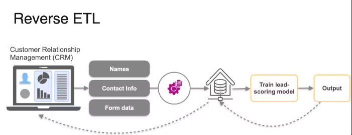

## Undercurrents of DE

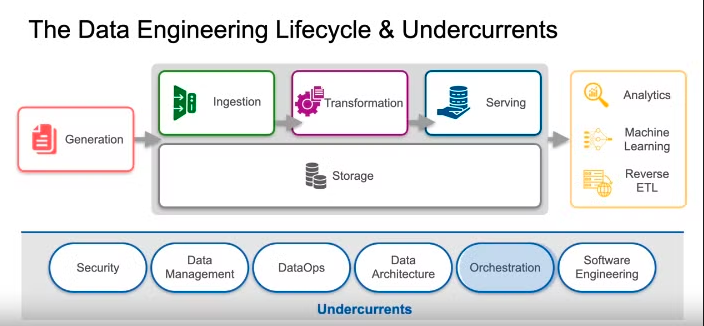

### Security:

> Security must be top of mind for data engineers, and those who ignore it do so at their peril. That’s why security is the first undercurrent. Data engineers must understand both data and access security, exercising the principle of least privilege. The principle of least privilege means giving a user or system access to only the essential data and resources to perform an intended function. A common antipattern we see with data engineers with little security experience is to give admin access to all users. This is a catastrophe waiting to happen!
> 

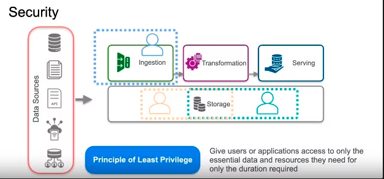

Since you’ll be using and serving data to users it is important to follow security principles, one of them is the principle of least privilege, in which you only give access to essential features.

### Data management:

Data management is the development, execution, and supervision of plans, programs, and practices that deliver, control, protect, and enhance the value of data information assets throughout their life cylces.

**Data governance**: is first, and foremost, a data management function to ensure the quality, integrity, security, and usability of the data collected by an organization.

**Data quality**

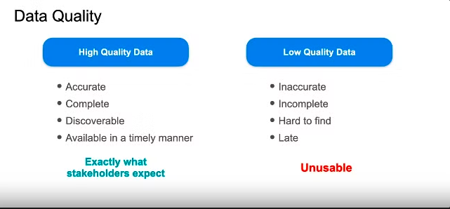

### Data architecture

Is the design of systems to support the evolving data needs of an enterprise, achieve by flexible and reversible decisions reached through a careful evaluation trade-offs

- evolving data needs: manage current and future data requiremens
- flexible and reversible decisions: being able to take care of unplanned data and make a system robust enough to handle

Trade-off:

- Performance
- Cost
- Scalability

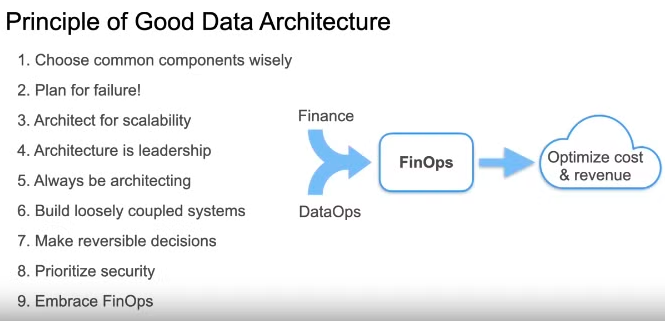

### DataOps

Improve the development process and quality of data products.

It’s a set of cultural habits and practices. 

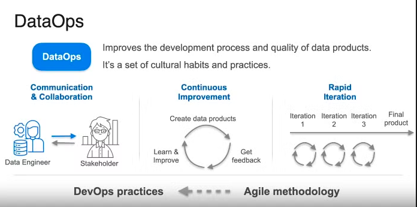

Pillars of DataOps: 

- Automation
- Observability & Moniroting
- Incident Response

Pillar 1: Automation

DevOps (applies to software build) CI/CD

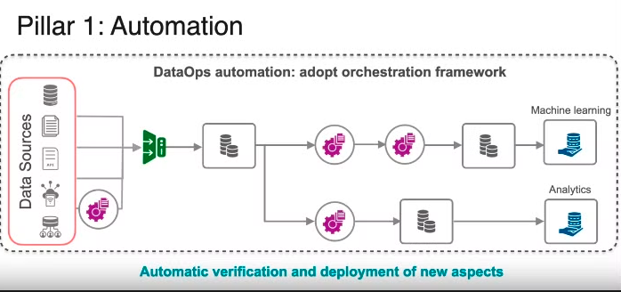

### Orchestration

Orchestration means connecting all pieces in coordinated way to make your system work

- Manual Execution
- Pure Scheduling: this is prone to errors given that it needs assume that all pipeline works

This frameworks allow to create triggers and evaluation checks.

- Automate pipeline with complex dependencies
- Monitor pipeline

Direct acyclic graph

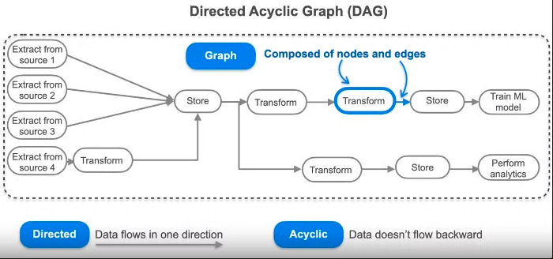

### Software Engineering

The design, development, deployment, and maintenance of software applications

Even though you need to write less code you still need to write code at each step and also good, clean and maintanable code

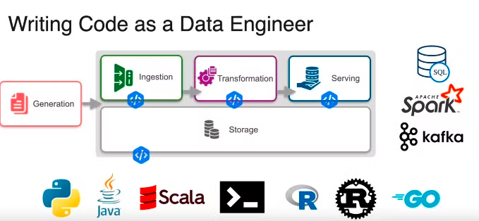

## Homework

1. how does the software engineering undercurrent apply to the work of a data engineer?

**a. Data engineers need to apply their software engineering skills and knowledge to read and write code.**

**b. Data engineers and software engineers both need to write code, but the programming languages data engineers use are completely different than the ones used by software engineers.**

**c. Data engineers do the same thing as software engineers but they simply have a different job title.**

**d. Data engineers only use software engineering skills to work on open source projects.**

Data engineers need to know how to read and write production-grade code that is clean, readable, testable, and deployable. For example, data engineers need to write core data processing code, develop infrastructure as code and pipeline as code solutions, and use or contribute to open source frameworks that require coding skills.

## Practical example on AWS

### The data engineering life cycle

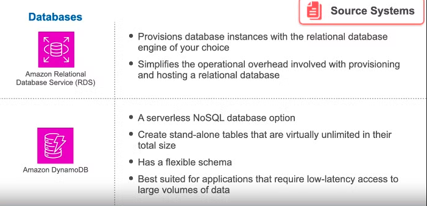

**Streaming Sources**

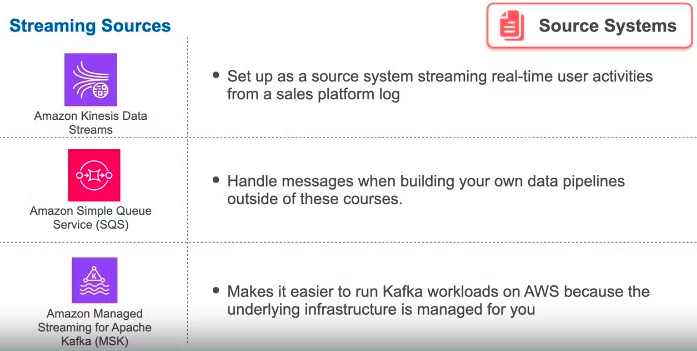

## Lab
The following picture represents the lab required to pass the second week of the course, which provides a hands-on experience on how to implement the DE lifecycle

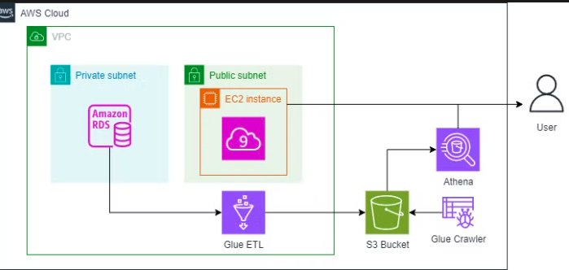